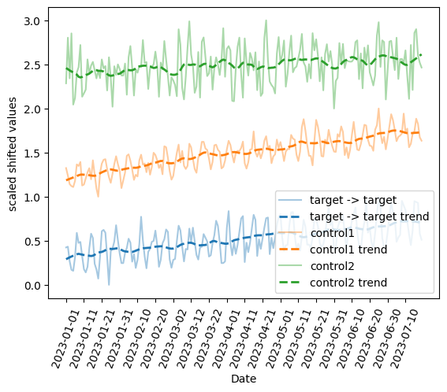
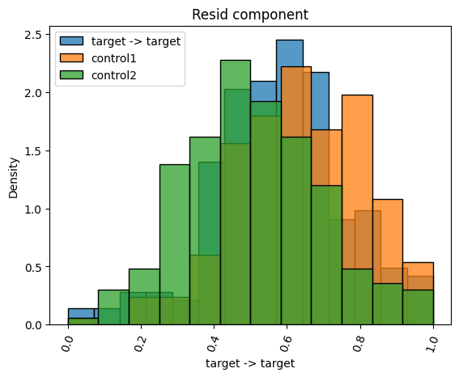
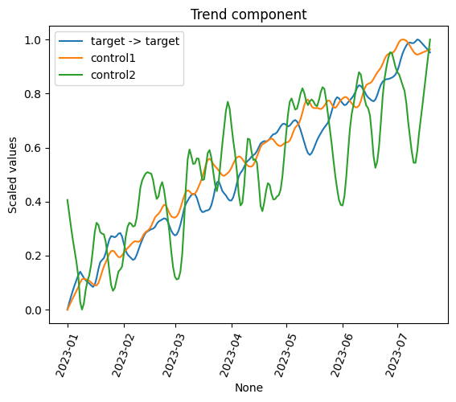
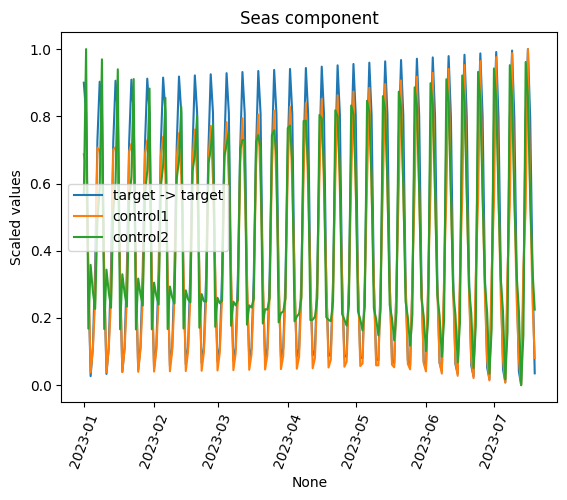
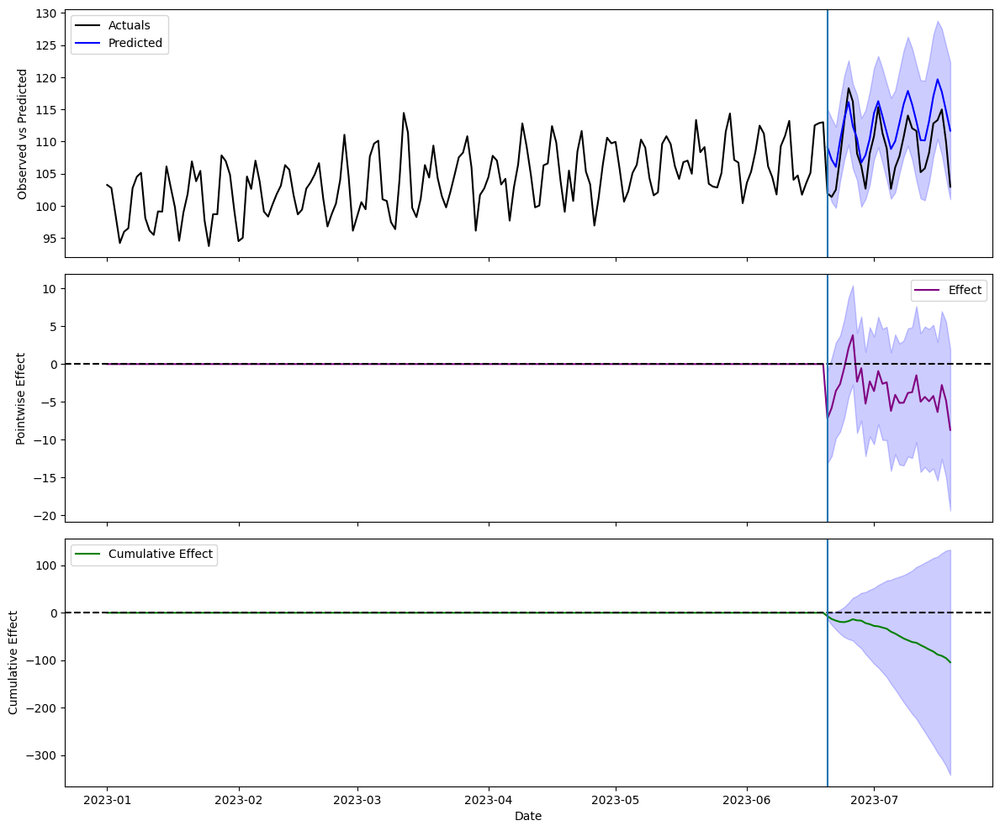
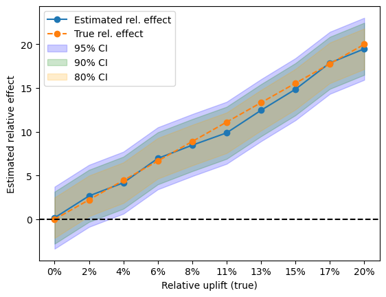
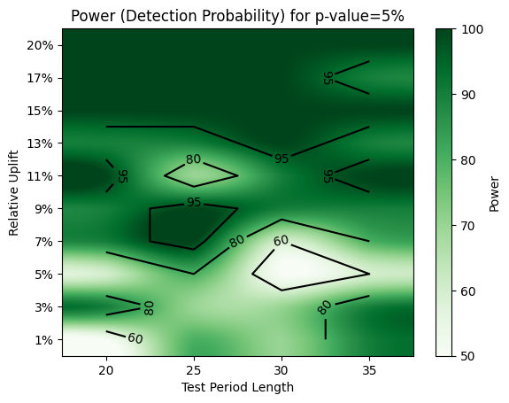

# Time serie impact 

## What is this ?

Set of modules to perform in depth analysis of time series and intervention simulation to assess the power of a model using underlying MLE model. Simple causalimpact-like wrapper for statsmodel's MLE  and PyBats. 

## How to install

```
pip install --extra-index-url=https://rspm.parship.internal/python-repo/latest/simple TimeSeries_impact
```

## Example usage

Import modules
```python 

from TimeSeries_impact import utilities, ts_analysis, impact, plot_functions

import matplotlib.pyplot as plt 
import pandas as pd
import numpy as np

import warnings
warnings.simplefilter(action='ignore', category=FutureWarning)
```

### Example, fake, dataset
```python

ts = utilities.make_time_serie(200, freq=[7], nbr_rand_event=5)
data = pd.DataFrame()
data["target"] = ts["obs"]
for i in range(len(ts["control"])):
    data[f"control {i}"] = ts["control"][i]

data.plot()
plt.show()
```

### Analyse time series and components
```python
# create TSA object
reload(ts_analysis)
TSA = ts_analysis.TSA(data)
```

```python
# check normalized and shifted ts
TSA.plot(scaled=True, shifted=True, with_trend=True)()
```


```python
# plot component from decomposition
TSA.plot()
TSA.plot_component()
```




```python
# analyse the similarity of the components
print()
print("Analysis results")
res_res, res_seas = TSA.analyze()
corr = TSA.correlation()

print()
print("Similarity of residuals")
print(res_res)

print()
print("Similarity of seasonality")
print(res_seas)

print()
print("Correlation of the time series")
print(corr)
```

### Perform causal impact analysis using different underlying models
```python
from TimeSeries_impact.ts_impact import causal_impact_pybats, causal_impact_mle

data = synthetic_ts.make_time_series(200)

data_tmp = data["data"]
test_size = 30
pre_period = [data_tmp.index[0], data_tmp.index[-1 - test_size]]
post_period = [data_tmp.index[-test_size], data_tmp.index[-1]]

bats = causal_impact_pybats.CausalImpactBayes(data_tmp, pre_period, post_period)
bats.run()

mle = causal_impact_mle.CausalImpactMLE(data_tmp, pre_period, post_period)
mle.run()
```

```python
# plot results  
fig_bats = bats.plot()
```



### Perform simulations to asses the power of the model
```python

# create impact class
impact_class = impact.SimImpact(data, backend="MLE")

# single simulation
relup = np.linspace(0.01, 0.2, 10)
impact_class.make_sim(relup_list=relup, test_size=14)
fig = impact_class.plot_sim_rel()
display(fig)
```


```python
# power analysis by looping over different pre- and post- period lengths
_ = impact_class.power_analyse(relup_list=relup)
fig_power = impact_class.plot_power(alpha=[5,10,20])
display(fig_power)
```


